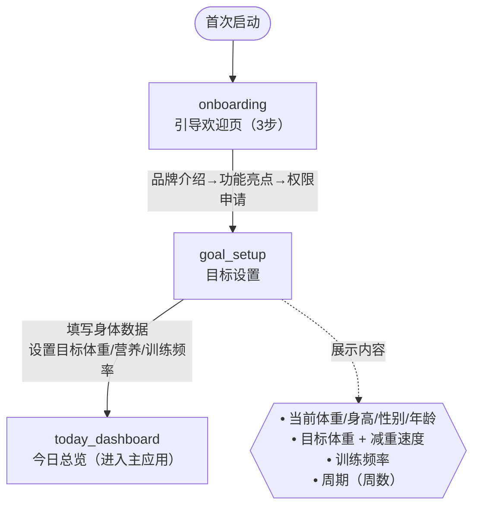
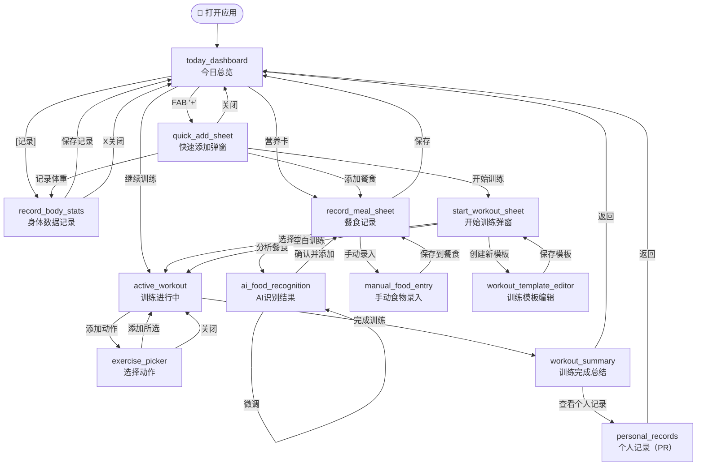
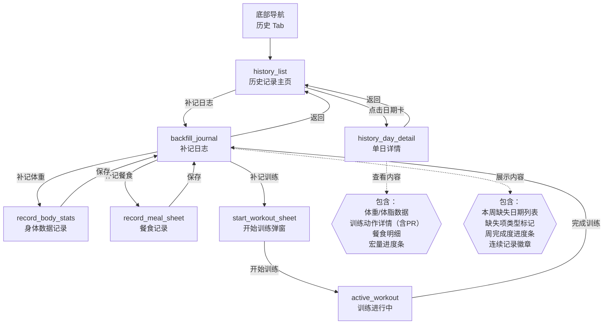
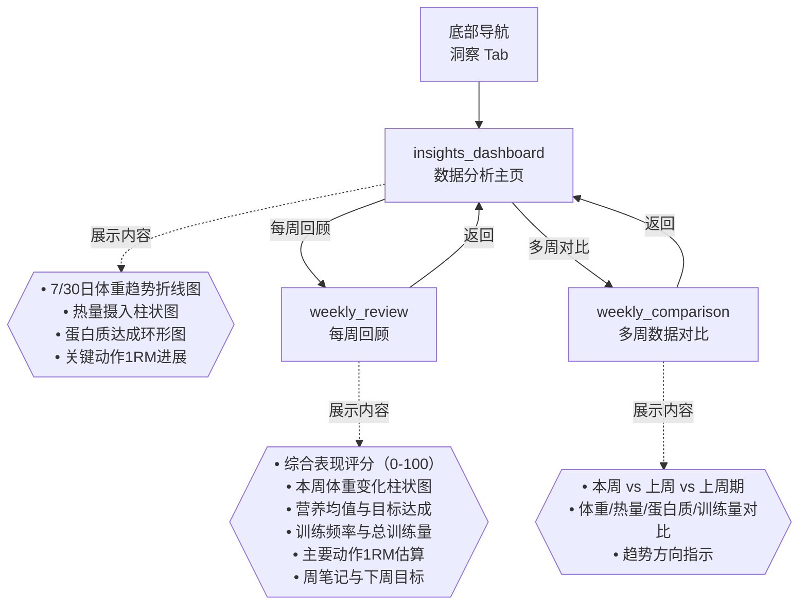
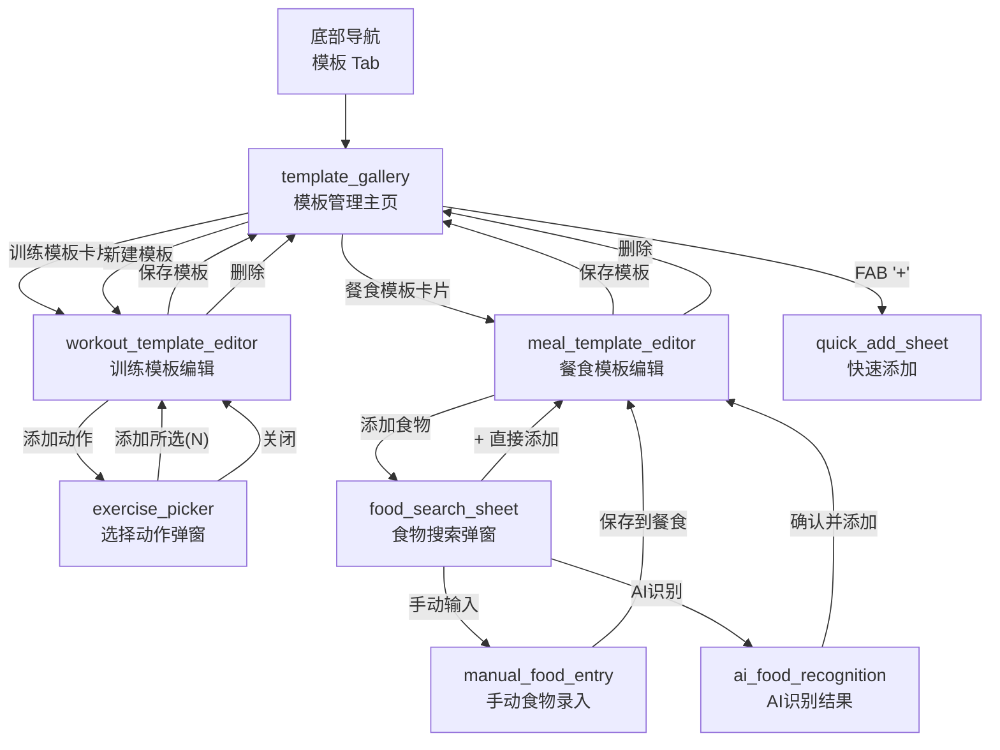
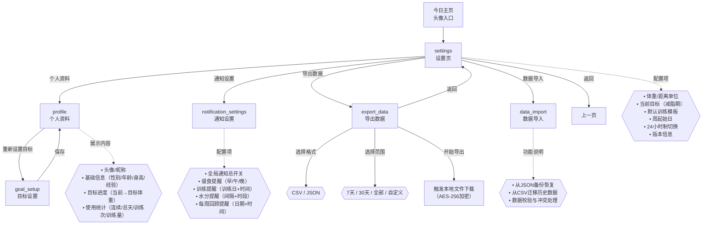
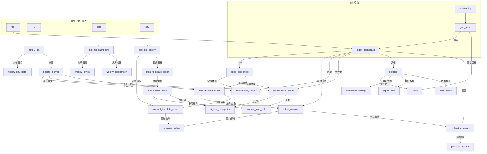

# Trainlytics 交互使用流程

> 使用 Mermaid 用例图描述整个项目的用户交互流程

---

## 一、系统参与者与用例总图

```mermaid
graph TB
    subgraph Actors["参与者"]
        User["👤 用户"]
        AI["🤖 AI识别引擎"]
        LocalDB["💾 本地数据库"]
    end

    subgraph App["Trainlytics 应用"]
        subgraph Launch["引导启动"]
            UC0a["首次引导"]
            UC0b["目标设置"]
        end

        subgraph Today["今日模块"]
            UC1["查看今日总览"]
            UC2["记录身体数据"]
            UC3["记录餐食"]
            UC4["开始训练"]
            UC5["进行训练中记录"]
            UC5b["查看训练完成总结"]
        end

        subgraph Nutrition["营养模块"]
            UC6["AI识别食物"]
            UC7["手动录入营养"]
            UC8["搜索食物数据库"]
        end

        subgraph History["历史模块"]
            UC9["浏览历史记录"]
            UC10["查看单日详情"]
            UC11["补记遗漏日志"]
        end

        subgraph Insights["洞察模块"]
            UC12["查看数据分析"]
            UC13["查看每周回顾"]
            UC13b["多周数据对比"]
        end

        subgraph Templates["模板模块"]
            UC14["管理训练模板"]
            UC15["管理餐食模板"]
            UC16["选择训练动作"]
        end

        subgraph Settings["设置模块"]
            UC17["配置应用设置"]
            UC17b["管理个人资料"]
            UC17c["配置通知提醒"]
            UC18["导出数据"]
            UC18b["导入数据"]
        end
    end

    User --> UC0a
    UC0a --> UC0b
    UC0b --> UC1

    User --> UC1
    User --> UC2
    User --> UC3
    User --> UC4
    User --> UC5
    UC5 --> UC5b
    UC5b --> UC19["查看个人记录PR"]

    User --> UC9
    User --> UC10
    User --> UC11
    User --> UC12
    User --> UC13
    User --> UC13b
    User --> UC14
    User --> UC15
    User --> UC17
    User --> UC17b
    User --> UC17c
    User --> UC18
    User --> UC18b

    UC3 --> UC6
    UC3 --> UC7
    UC6 --> AI
    UC8 --> LocalDB
    UC2 --> LocalDB
    UC3 --> LocalDB
    UC5 --> LocalDB
    UC18 --> LocalDB
    UC18b --> LocalDB
```

---

## 二、首次启动/引导流程

---

## 三、今日记录核心流程

---

## 四、历史记录与补记流程

---

## 五、数据洞察流程

---

## 六、模板管理流程

---

## 七、设置与账户流程

---

## 八、页面跳转关系图（全局视图）

